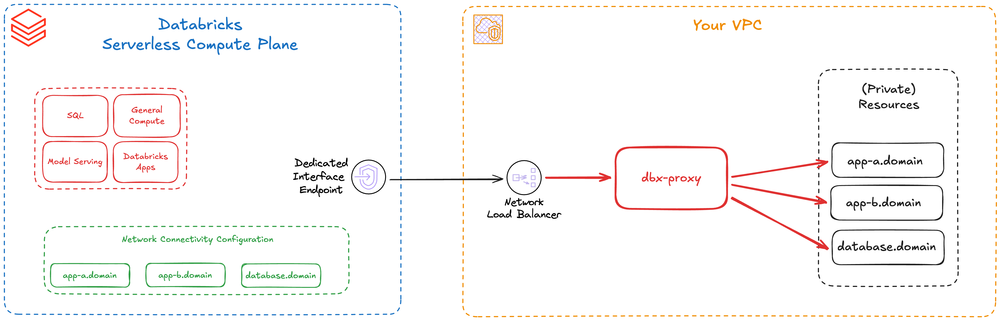

## dbx-proxy

> [!IMPORTANT]
> **Deprecated:** This repository has migrated to [databricks-solutions/dbx-proxy](https://github.com/databricks-solutions/dbx-proxy) and will be discontinued (no further active development or maintenance).

`dbx-proxy` is a lightweight **HAProxy-based load balancer** that enables **private network connectivity** from **Databricks Serverless** compute to **resources in your own VPC/VNet** (for example: databases, applications, etc).

### What problem it solves

Many enterprise resources live in private networks and are not reachable from serverless compute by default. `dbx-proxy` provides a controlled entry point for [private connectivity to resources in your VPC/Vnet](https://docs.databricks.com/aws/en/security/network/serverless-network-security/pl-to-internal-network).


Connectivity to your custom resources can be configured via a dedicated Private Endpoint that is connected to a Network Load Balancer (AWS) in your network. From there on you can route traffic accordingly to targets. However, this approach comes with certain limiations for routing of network traffic due to limitations of cloud-provider offerings, e.g. a NLB on AWS does only operate on Layer 4 of the TCP/IP stack, allowing traffic to be routed only by IP/Port. `dbx-proxy` solves this problem by introducing an additional component which receives all traffic from your NLB and takes over the routing logic for individual targets based on your configuration. It is able to operate on Layer 4 & 7 providing greater flexibility for reaching your targets from Databricks Serverless compute.


### What you get

`dbx-proxy` is a haproxy based load-balancing solution and runs as an additional component between the NLB and your private resources. It receives all traffic and is capable of handling fanout to multiple resources. Traffic flows from Databricks Serverless through the Private Endpoint & NLB, into `dbx-proxy`, and then on to your target resources based on your provided configuration. Applications can be reached through individual domains: your NLB listener forwards the connection to `dbx-proxy`, which for TLS passthrough traffic inspects the domain via SNI and maps it to the configured backend targets (for example, `app-a.domain` -> targets for app A, `app-b.domain` -> targets for app B). This allows to listen on a single port and route traffic to multiple targets. For plain tcp traffic, e.g. database connections, one listener maps to one target/database.



- **Forwarding of L4 & L7 network traffic** based on your configuration
  - L4 (TCP): forwarding of plain TCP traffic, e.g. for databases
  - L7 (HTTP) forwarding of HTTP(s) traffic with **SNI-based routing**, e.g. for applications/API's
- **Terraform module** ready to use for **AWS and Azure**
- No TLS termination, only passthrough!


### High availability

High Availability depends on how many instances you run and whether your deployment spans multiple availability zones in your cloud. See the Terraform module details for configuration and behavior: [Terraform module documentation](terraform/README.md).

### Deployment (Terraform) / How to use

`dbx-proxy` provides the customer-side components (Step 1 and 2) when following the official Databricks documentation for private connectivity to resources in your own networks:
- [(AWS) Configure private connectivity to resources in your VPC](https://docs.databricks.com/aws/en/security/network/serverless-network-security/pl-to-internal-network)
- [(Azure) Configure private connectivity to resources in your Vnet](https://learn.microsoft.com/en-us/azure/databricks/security/network/serverless-network-security/pl-to-internal-network)


Include the module in your Terraform stack (example for AWS):
```hcl
module "dbx_proxy" {

  source = "github.com/dnks0/dbx-proxy//terraform/aws?ref=v<release>"

  # aws config
  region    = "eu-central-1"
  tags      = {}
  ...

  # dbx-proxy config
  dbx_proxy_image_version = "<release>"
  dbx_proxy_health_port   = 8080

  # Example: forward TCP/443 to a private target in your VPC
  dbx_proxy_listener = [
    {
      name  = "http-443"
      mode  = "http"
      port  = 443
      routes = [
        {
          name    = "example"
          domains = ["example.internal"]
          destinations = [
            { name = "example-server-1", host = "10.0.1.10", port = 443 },
          ]
        }
      ]
    }
  ]
}
```

More details about the Terraform module (including Azure) can be found [here](terraform/README.md).

You will still need to configure the Databricks-side objects like NCC, private endpoint rules and accept the connection on your endpoint-service.

By default the module runs in `deployment_mode = "bootstrap"` and can create networking, an internal load balancer (NLB/SLB), and a private endpoint service (Private Link). If you already have networking, keep `deployment_mode = "bootstrap"` and provide the network IDs. If you already have a load balancer as well, set `deployment_mode = "proxy-only"` and provide the load balancer ID/ARN (see Terraform docs for details).

### Troubleshooting

To validate that the proxy is up and reachable,run the following from e.g. a serverless notebook:

```bash
%sh

curl -sS -w '\nHTTP %{http_code}\n' http://<ncc-endpoint-rule-domain>:8080/status
```

### Limitations / Trade-Offs
Before going to production, please review the following [limitations & trade-offs](terraform/README.md#limitations--tradeoffs-of-the-current-implementation).
