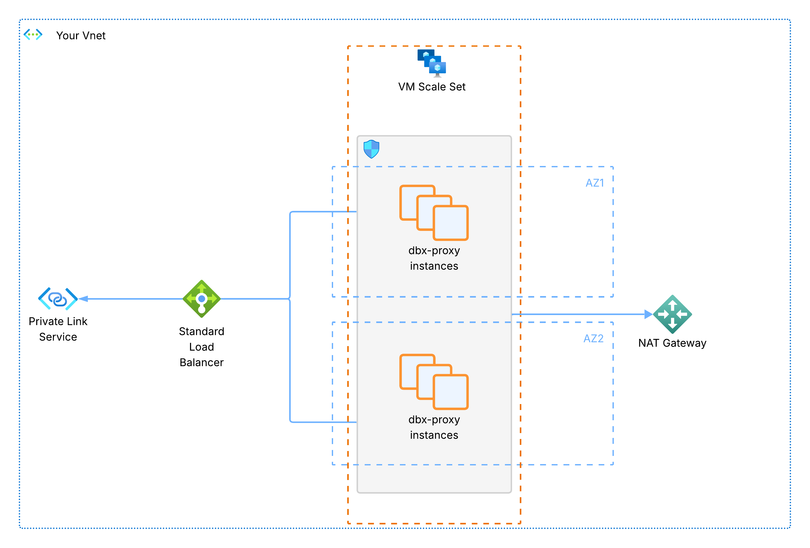

## Azure Terraform module: `dbx-proxy`

This module deploys `dbx-proxy` on Azure, using an internal Standard Load Balancer and a Private Link Service for Databricks Serverless private connectivity.

For common concepts (listener config, deployment modes, overall limitations), see the global module documentation in `terraform/README.md`.

#### Architecture



This module provisions a private Standard Load Balancer with a backend pool and probe, a Private Link Service for private communication from Databricks serverless, and a VM scale set of `dbx-proxy` instances in your VNet.
The VM scale set will automatically span multiple availability-zones for robustness.
Optional bootstrap networking creates the VNet, subnet, and NAT gateway when not provided.

---

### Quick start

In your existing Terraform stack, add:

```hcl
module "dbx_proxy" {
  source = "github.com/dnks0/dbx-proxy//terraform/azure?ref=v<release>"

  # Azure config
  location       = "westeurope"
  resource_group = "rg-dbx-proxy"  # optional in bootstrap mode
  tags           = {}

  # dbx-proxy config
  dbx_proxy_image_version = "<release>"
  dbx_proxy_health_port   = 8080
  dbx_proxy_listener      = []
}
```

Make sure to replace `<release>` with the actual release version!

Then run:

```bash
terraform init
terraform apply
```

After apply, use the output `load_balancer.private_link_service_alias` when creating Databricks private endpoint rules in your NCC. Also, add a domain of your choice as private endpoint rule on your NCC that you can use for troubleshooting.

---

### Azure-specific variables

| Variable | Type | Default | Description |
|---|---:|---:|---|
| `location` | `string` | (required) | Azure region to deploy to. |
| `resource_group` | `string` | `null` | Resource group name. Required in `proxy-only` mode. If `null` in `bootstrap`, a new one is created. |
| `vnet_name` | `string` | `null` | Existing VNet name. If `null` in `bootstrap`, a new VNet is created. |
| `subnet_name` | `string` | `null` | Existing subnet name. If empty in `bootstrap`, a new subnet is created. |
| `vnet_cidr` | `string` | `"10.0.0.0/16"` | VNet CIDR (only used when bootstrapping). |
| `subnet_cidr` | `string` | `"10.0.1.0/24"` | Subnet CIDR (only used when bootstrapping). |
| `enable_nat_gateway` | `bool` | `true` | Whether to create a NAT Gateway (only when bootstrapping). |
| `slb_name` | `string` | `null` | Existing Load Balancer name. Required in `proxy-only` mode. |

Common variables are documented in `terraform/README.md`.

---

### Outputs

- `resource_group`: name of the resource group used

- `networking`: object with
  - `vnet_name`
  - `vnet_cidr`
  - `subnet_id`
  - `subnet_name`
  - `subnet_cidr`
  - `nat_gateway_name`
  - `nat_gateway_id`

- `load_balancer`: object with
  - `slb_name`
  - `slb_id`
  - `slb_backend_pool_id`
  - `private_link_service_id`
  - `private_link_service_alias`

- `proxy`: object with
  - `nsg_id`
  - `vmss_name`
  - `vmss_id`
  - `dbx_proxy_cfg`

---

### Notes for Azure users

- If `resource_group` is provided, it must already exist. If `null` in `bootstrap` mode, a new one is created.
- Multi availability-zone resilience is achieved by the virtual machine scale set balancing VMs over multiple availability zones.
- In Azure a subnet spans multiple availability-zones, therefore a single subnet is sufficient. In `proxy-only` mode, you are responsible to provide a subnet. In `bootstrap` mode, a default subnet is created.